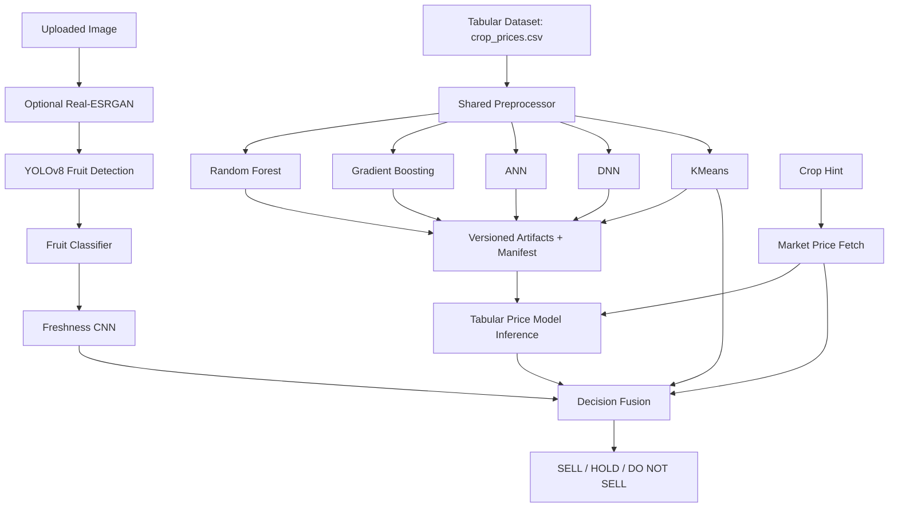
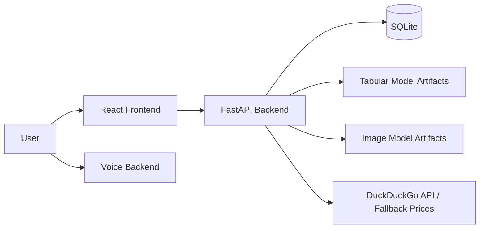

# AgriIntel: A Multimodal Agricultural Decision-Support System for Crop Price Band Classification, Fruit Freshness Screening, and Rule-Guided Sell/Hold Recommendations

## Abstract
AgriIntel is an applied agricultural decision-support system that combines tabular market-price modeling, image-based produce screening, heuristic market enrichment, and API-driven serving into a single deployable stack. The repository implements three distinct machine learning components: (1) a crop-price classifier trained on a tabular market dataset (`crop_prices.csv`), (2) image models for fruit-domain validation and freshness classification, and (3) a KMeans clustering model used as an auxiliary market-pattern signal. These models are integrated into a FastAPI backend that also provides persistence, authentication, rate limiting, explainability-oriented response fields, and optional image enhancement via Real-ESRGAN.

The strongest experimentally supported component is the tabular crop-price classifier. The production training pipeline constructs a three-class target (`Low`, `Medium`, `High`) by thresholding `modal_price`, then predicts this derived label from `min_price`, `max_price`, and ordinal-encoded categorical metadata. Stored artifacts report high held-out performance for Random Forest, Gradient Boosting, ANN, and DNN variants, with macro-F1 ranging from 0.9720 to 0.9937. However, these results must be interpreted cautiously because the target is derived from the same record-level price fields used as predictors, creating a strong shortcut signal.

The image pipeline is operational for inference but only partially reproducible from the repository: trained weights are present, while the underlying image training datasets are not. Notebook evidence shows exploratory CNN, EfficientNet-based fruit classification, and agent-style multimodal experiments, but not all notebook claims are preserved in the production backend. Consequently, the main contribution of the repository is best understood as system integration rather than algorithmic novelty. This paper reconstructs the implementation faithfully, reports verified results, and audits the system's methodological and reproducibility limitations.

## 1. Introduction
Agricultural decision-support systems frequently need to combine heterogeneous evidence sources: market prices, crop identity, regional context, and visible produce quality. AgriIntel addresses this practical need by assembling a multimodal pipeline that estimates crop price bands, checks whether an uploaded image contains a supported fruit, assesses freshness, enriches decisions with lightweight market-price retrieval, and generates sell/hold guidance through explicit rules.

The repository targets a real operational setting rather than a purely offline benchmark. The backend exposes REST endpoints for tabular prediction, image prediction, combined smart decisions, model-metric inspection, market snapshots, and lightweight user authentication. A React frontend and a separate voice-oriented backend indicate an intended deployment as an interactive AI-assisted agricultural platform.

The underlying problem formulation is not a single classical ML task. Instead, the codebase implements:

| Subsystem | Problem Type | Production Status |
| --- | --- | --- |
| Crop price modeling | Supervised 3-class classification | Fully implemented and artifact-backed |
| Market clustering | Unsupervised clustering | Implemented as auxiliary signal |
| Fruit freshness screening | Image classification | Inference implemented; training data absent from repo |
| Fruit-domain validation | Object detection + image classification | Inference implemented |
| Crop recommendation | Rule-based ranking using dataset medians | Implemented without retraining |
| Smart decision engine | Multimodal decision fusion | Implemented |

The practical stakeholders are farmers, produce aggregators, and market intermediaries who may benefit from guidance on whether to sell immediately, hold inventory, or reject low-quality produce. The system’s domain context is therefore agricultural market intelligence and post-harvest decision support.

From a research perspective, the key question is not whether AgriIntel introduces a new learning algorithm. It does not. The more relevant question is whether the repository implements a coherent, reproducible multimodal decision pipeline and whether its empirical claims are justified by the available artifacts. This paper answers that question by reverse-engineering the codebase, tracing the data and model flow, and separating verified evidence from unsupported narrative.

### Contributions
The implementation supports the following evidence-backed contributions:

1. A productionized tabular training pipeline for crop-price band classification using shared preprocessing across tree-based and neural models.
2. A deployed multimodal inference pipeline that combines image screening, price-band prediction, clustering, market-price retrieval, and rule-based hold/sell logic.
3. Versioned artifact export, manifesting, and backend model loading for reproducible deployment.
4. A reproducibility audit revealing important limitations, including shortcut risk in the tabular task and incomplete reproducibility of the image models.

## 2. Related Work
AgriIntel sits at the intersection of several standard methodological families.

First, crop-market modeling is often approached through regression, time-series forecasting, or classification over engineered price bands. The repository chooses classification, not direct forecasting. This simplifies deployment and decision logic, but it also reduces granularity and introduces sensitivity to the chosen class thresholds.

Second, produce-quality assessment commonly uses convolutional neural networks or transfer learning on fruit freshness datasets. The notebooks experiment with both a small scratch CNN and a larger transfer-learning setup, while the production backend consumes pre-trained image artifacts rather than retraining them.

Third, multimodal agricultural agents often mix perception, market information, and decision heuristics. AgriIntel follows this pattern through late fusion rather than end-to-end multimodal learning: image models and tabular models are trained separately, then joined through rule-based post-processing.

Fourth, unsupervised clustering is sometimes used to discover market segments or product groups. Here, KMeans is included as an auxiliary descriptive signal rather than a core predictive engine.

No verified evidence in the repository supports claims of state-of-the-art accuracy, novel architecture, or rigorous benchmarking against external systems. Relative to standard ML practice, the main distinguishing feature is system integration across multiple tasks and serving components.

## 3. Methodology
### 3.1 System Overview
The production pipeline is implemented primarily in `backend/ml_pipeline.py`, `backend/predict.py`, `backend/predict_image.py`, `backend/market_data.py`, and `backend/smart_decision.py`.

### 3.2 Tabular Price Classification Pipeline
The crop-price model uses the market dataset at `dataset/crop_prices.csv`, with columns:

- Categorical: `state`, `district`, `market`, `commodity`, `variety`, `grade`, `arrival_date`
- Numeric: `min_price`, `max_price`
- Derived target source: `modal_price`

The target class is constructed deterministically:

\[
y =
\begin{cases}
\text{Low}, & \text{if } \text{modal\_price} < 1500 \\
\text{Medium}, & \text{if } 1500 \le \text{modal\_price} < 4000 \\
\text{High}, & \text{if } \text{modal\_price} \ge 4000
\end{cases}
\]

This is implemented in `_price_bucket()` inside `backend/ml_pipeline.py`.

Preprocessing is shared across all tabular models:

1. Drop rows missing any categorical field, `min_price`, `max_price`, or `modal_price`.
2. Convert categorical columns to stripped strings.
3. Convert price columns to numeric.
4. Fit an `OrdinalEncoder(handle_unknown="use_encoded_value", unknown_value=-1)` on the training split only.
5. Concatenate numeric prices with ordinal-encoded categorical columns.
6. Fit a `StandardScaler` on the resulting feature matrix.

The scaled feature vector has nine dimensions:

| Index | Feature |
| --- | --- |
| 1 | `min_price` |
| 2 | `max_price` |
| 3 | `state_encoded` |
| 4 | `district_encoded` |
| 5 | `market_encoded` |
| 6 | `commodity_encoded` |
| 7 | `variety_encoded` |
| 8 | `grade_encoded` |
| 9 | `arrival_date_encoded` |

### 3.3 Supervised Models
The supervised candidates are:

| Model | Library | Key Hyperparameters |
| --- | --- | --- |
| Random Forest | scikit-learn | `n_estimators=150`, `min_samples_leaf=2`, `random_state=42` |
| Gradient Boosting | scikit-learn | `n_estimators=120`, `learning_rate=0.05`, `max_depth=3`, `random_state=42` |
| ANN | Keras | Dense `[64, 32]`, dropout `[0.15, 0.10]`, Adam `1e-3` |
| DNN | Keras | Dense `[128, 64, 32]`, dropout `[0.20, 0.15, 0.10]`, Adam `1e-3` |

The neural models are optimized with sparse categorical cross-entropy:

\[
\mathcal{L} = - \sum_{c=1}^{C} \mathbf{1}[y=c]\log p(c \mid x)
\]

where \( C = 3 \) classes (`Low`, `Medium`, `High`).

Training details for the neural models:

- Epoch limit: `40`
- Batch size: `32`
- Validation split inside training: `0.2`
- Early stopping patience: `8`
- Best-checkpoint saving enabled

### 3.4 Evaluation Procedure
The training pipeline uses:

- Train/test split: `80/20`, stratified, `random_state=42`
- Cross-validation for scikit-learn models only: `StratifiedKFold(n_splits=3, shuffle=True, random_state=42)`
- Metrics: accuracy, macro-F1, macro-precision, macro-recall
- Additional artifacts: confusion matrix, learning curves, validation curves

Important methodological note: ANN and DNN models are evaluated on the held-out test split, but no cross-validation is implemented for them in the production pipeline.

### 3.5 KMeans Auxiliary Clustering
The pipeline also fits:

- `KMeans(n_clusters=3, random_state=42, n_init=10)`

on the same scaled feature space used for supervised training. The KMeans objective is the standard within-cluster distortion minimization:

\[
\min_{\{\mu_k\}} \sum_{i=1}^{N} \min_{k \in \{1,\dots,K\}} \|x_i - \mu_k\|_2^2
\]

In the production backend, cluster identity and centroid distance are returned as descriptive signals during inference.

### 3.6 Image Pipeline
The production image stack in `backend/predict_image.py` performs:

1. Byte decoding using OpenCV, with PIL fallback.
2. YOLOv8n-based object detection (`yolov8n.pt`).
3. Restriction to supported detector labels: `apple`, `banana`, `orange`, `carrot`.
4. Region cropping and secondary classification using `fruit_classifier.h5`.
5. Freshness classification using `cnn_food_quality_model.h5` on resized `128 x 128` RGB input.

The production freshness label set is binary:

- `Fresh`
- `Rotten`

The production fruit-classifier label set contains 20 classes combining produce identity and freshness, for example `fresh apple`, `rotten banana`, `fresh tomato`, and `rotten bell pepper`.

### 3.7 Market Retrieval and Decision Logic
`backend/market_data.py` attempts a lightweight web query using the DuckDuckGo instant-answer API. If no usable numeric price mentions are extracted, the system falls back to hard-coded crop-specific price bands. The fallback source is labeled `"dataset_median"` in the response, although the code actually uses a static dictionary rather than computing medians online at query time.

The smart decision engine then combines:

- Fruit detection status
- Freshness label
- Crop hint
- Estimated market price band
- Tabular model prediction
- KMeans cluster output

into a final recommendation. The final decision is not learned end-to-end; it is rule-based:

- If image is not a valid fruit: stop pipeline.
- If freshness is `Rotten`: `DO NOT SELL`.
- Else if price prediction recommends sell: `SELL`.
- Else: `HOLD`.

Hold duration is configurable through settings:

| Condition | Hold Days |
| --- | --- |
| Low price class | 7 |
| Medium price class | 4 |
| Favorable sell case | 1 |

### 3.8 Deployment Architecture
The backend is a FastAPI service with:

- CORS enabled for all origins
- Request logging using JSON logs
- JWT-based authentication
- SQLite persistence (`agriintel.db`)
- Rate limiting via `slowapi`
- Startup artifact loading via lifespan hooks

The repository also includes:

- A React/Vite frontend
- A second FastAPI-based voice backend under `backend/voice-to-voice`
- Startup scripts for Windows (`start.bat`) and Unix-like shells (`start.sh`)

## 4. Dataset and Preprocessing
### 4.1 Tabular Dataset
The tabular dataset `dataset/crop_prices.csv` is present in the repository.

| Property | Value |
| --- | --- |
| Rows | 8,578 |
| Columns | 10 |
| Missing values | 0 in the current CSV file |
| Categorical columns | 7 |
| Numeric columns | 3 (`min_price`, `max_price`, `modal_price`) |

Schema:

| Column | Type | Unique Values |
| --- | --- | --- |
| `state` | string | 21 |
| `district` | string | 179 |
| `market` | string | 460 |
| `commodity` | string | 143 |
| `variety` | string | 209 |
| `grade` | string | 14 |
| `arrival_date` | string | 1 |
| `min_price` | float | 312 |
| `max_price` | float | 351 |
| `modal_price` | float | 413 |

Descriptive statistics:

| Variable | Mean | Std | Min | Median | Max |
| --- | --- | --- | --- | --- | --- |
| `min_price` | 4120.55 | 3740.53 | 3.0 | 3500.0 | 80000.0 |
| `max_price` | 4653.17 | 4150.53 | 5.0 | 4000.0 | 85000.0 |
| `modal_price` | 4388.03 | 3930.97 | 4.0 | 3600.0 | 82500.0 |

Derived class distribution:

| Class | Count |
| --- | --- |
| Low | 632 |
| Medium | 4,322 |
| High | 3,624 |

The dataset is geographically imbalanced. `Tamil Nadu` alone contributes 7,091 of 8,578 rows, which should be considered when interpreting generalization claims across India.

### 4.2 Preprocessing Characteristics
The tabular pipeline performs no explicit:

- outlier clipping
- temporal feature extraction
- class reweighting
- resampling
- target smoothing

`arrival_date` is retained as a categorical feature, but in the provided CSV it has only one unique value (`01/03/2026`). In practice, this column contributes no temporal variation to the production model.

### 4.3 Image Data
The repository includes model weights for image inference but does not include the training image datasets used to obtain them. Notebook evidence indicates at least two image-data regimes:

| Notebook Evidence | Purpose | Verified in Repo |
| --- | --- | --- |
| `dataset_clean` with `Fresh` / `Rotten` folders | Binary freshness CNN | Training data absent |
| `dataset_fixed` with 20 classes | Fruit identity + freshness classifier | Training data absent |

Notebook output states:

- `Found 9599 images belonging to 20 classes.`
- `Found 2387 images belonging to 20 classes.`

These counts are useful as provenance clues, but they are not independently reproducible from the repository contents.

## 5. Experimental Setup
### 5.1 Software Stack
Verified backend dependencies include:

| Category | Libraries |
| --- | --- |
| API | FastAPI, Uvicorn |
| Tabular ML | scikit-learn, NumPy, pandas, joblib |
| Neural models | TensorFlow / Keras |
| Image processing | Pillow, OpenCV |
| Detection | Ultralytics YOLO |
| Enhancement | PyTorch, BasicSR, Real-ESRGAN |
| Security | python-jose, passlib |
| Persistence | SQLite (stdlib) |

Training metadata from the saved production artifacts records:

| Item | Value |
| --- | --- |
| Python | `3.11.9` |
| TensorFlow | `2.21.0` |
| NumPy | `2.4.4` |
| Seed | `42` |
| Train size | `6862` |
| Test size | `1716` |

### 5.2 Determinism
`backend/ml_pipeline.py` explicitly sets:

- `PYTHONHASHSEED`
- NumPy seed
- Python `random` seed
- TensorFlow seed
- `TF_DETERMINISTIC_OPS=1`

This is a strong reproducibility feature for the tabular and neural training pipeline.

### 5.3 Hardware
Hardware for the stored experiments is not specified in the production metadata. The code reveals:

- Real-ESRGAN auto-selects CUDA if available, else CPU.
- The notebooks were likely executed in Google Colab-like environments, but this is inferential rather than formally logged.

Therefore:

`Not specified in the implementation.`

### 5.4 Notebook Experiment Context
The notebooks contain exploratory experiments beyond the production pipeline, including:

- scratch CNN freshness modeling
- variational autoencoder-based synthetic data generation
- hierarchical clustering and DBSCAN
- Selenium-based web scraping
- SHAP and Grad-CAM style explainability experiments

These experiments are useful for understanding project evolution, but they are not all integrated into the deployed backend.

## 6. Results and Evaluation
### 6.1 Production Tabular Model Results
The strongest verifiable results come from `backend/models/model_metrics_20260507T091738Z.json`.

#### Overall Comparison
| Model | Test Accuracy | Macro-F1 | Weighted-F1 | CV Accuracy Mean | CV Accuracy Std |
| --- | --- | --- | --- | --- | --- |
| Random Forest | 0.9965 | 0.9919 | 0.9965 | 0.9950 | 0.00135 |
| Gradient Boosting | 0.9959 | 0.9937 | 0.9959 | 0.9968 | 0.00021 |
| ANN | 0.9889 | 0.9736 | 0.9888 | Not specified in the implementation. | Not specified in the implementation. |
| DNN | 0.9889 | 0.9720 | 0.9887 | Not specified in the implementation. | Not specified in the implementation. |

Gradient Boosting attains the highest macro-F1, while Random Forest is configured as the deployment default in the artifact manifest.

#### Per-Class Performance: Random Forest
| Class | Precision | Recall | F1 | Support |
| --- | --- | --- | --- | --- |
| Low | 0.9919 | 0.9683 | 0.9799 | 126 |
| Medium | 0.9942 | 0.9988 | 0.9965 | 865 |
| High | 1.0000 | 0.9986 | 0.9993 | 725 |

Confusion matrix:

| True \ Pred | Low | Medium | High |
| --- | --- | --- | --- |
| Low | 122 | 4 | 0 |
| Medium | 1 | 864 | 0 |
| High | 0 | 1 | 724 |

#### Per-Class Performance: Gradient Boosting
| Class | Precision | Recall | F1 | Support |
| --- | --- | --- | --- | --- |
| Low | 1.0000 | 0.9762 | 0.9880 | 126 |
| Medium | 0.9942 | 0.9977 | 0.9960 | 865 |
| High | 0.9972 | 0.9972 | 0.9972 | 725 |

Confusion matrix:

| True \ Pred | Low | Medium | High |
| --- | --- | --- | --- |
| Low | 123 | 3 | 0 |
| Medium | 0 | 863 | 2 |
| High | 0 | 2 | 723 |

#### Per-Class Performance: ANN
| Class | Precision | Recall | F1 | Support |
| --- | --- | --- | --- | --- |
| Low | 0.9741 | 0.8968 | 0.9339 | 126 |
| Medium | 0.9829 | 0.9954 | 0.9891 | 865 |
| High | 0.9986 | 0.9972 | 0.9979 | 725 |

#### Per-Class Performance: DNN
| Class | Precision | Recall | F1 | Support |
| --- | --- | --- | --- | --- |
| Low | 0.9910 | 0.8730 | 0.9283 | 126 |
| Medium | 0.9796 | 0.9988 | 0.9891 | 865 |
| High | 1.0000 | 0.9972 | 0.9986 | 725 |

### 6.2 Learning and Validation Curves
The stored artifacts contain learning curves and validation curves for the scikit-learn models.

Observed patterns:

- Training accuracy is nearly perfect for both tree ensembles.
- Validation accuracy rises monotonically with more training data.
- The `n_estimators` validation curve for Random Forest peaks around 100 trees and slightly decreases at 150.
- Gradient Boosting validation accuracy improves from 50 to 100 estimators and then plateaus.

These patterns indicate low apparent generalization error on the chosen task, but they do not rule out target shortcut effects.

### 6.3 Notebook Clustering Results
Notebook output for `Updated_MDM_crop_prices.ipynb` reports:

| Algorithm | Silhouette | Davies-Bouldin | Calinski-Harabasz |
| --- | --- | --- | --- |
| DBSCAN | 0.314125 | 0.000000 | 0.000000 |
| K-Means | 0.242370 | 1.120206 | 1052.935348 |
| Hierarchical | 0.192652 | 1.363363 | 872.658920 |

These values come from notebook output, not the production backend. The backend’s `/clusters` endpoint currently returns `silhouette_score: 0.0`, indicating that clustering evaluation was not fully wired into serving.

### 6.4 Notebook Image Results
Notebook evidence for the 20-class fruit classifier shows:

- One-epoch EfficientNetB0 training
- Training accuracy: `0.0475`
- Validation accuracy: `0.0507`

These values indicate that the notebook’s transfer-learning experiment, as saved, did not achieve meaningful performance in one epoch. This is an important corrective to any stronger narrative around fruit classification quality.

Notebook evidence also includes qualitative runs of an image-analysis demo, but those runs are not sufficient to establish benchmark-level image performance.

### 6.5 Engineering Runtime Evidence
The SQLite database currently contains:

| Table | Rows |
| --- | --- |
| `predictions` | 11 |
| `users` | 0 |

This confirms at least limited local runtime use of the backend, but it is not a statistically meaningful deployment evaluation.

## 7. Discussion
The tabular subsystem performs extremely well on the defined three-class task because the class label is a thresholded function of `modal_price`, while the model is given `min_price` and `max_price` from the same record. Since all three prices are market price descriptors from a single observation, the classification problem is substantially easier than a true future-price forecasting problem. This explains why even modest architectures obtain near-ceiling performance.

The strongest engineering decision in the repository is the use of a shared preprocessing artifact across all deployment models. This avoids train-serving skew, enables versioned model loading, and makes the FastAPI backend operationally coherent.

The multimodal smart-decision layer is useful as a product integration mechanism, but it is not a learned multimodal model. The image pipeline, tabular pipeline, market lookup, and holding strategy are fused through deterministic rules. This has two consequences:

1. The system is interpretable at the decision-policy level.
2. The final recommendations inherit the limitations of each upstream module without an evidence-based mechanism for uncertainty calibration across modalities.

The image subsystem is practical for demo and API use, but not fully auditable as a research result because the training datasets are absent. The presence of trained weights permits inference, yet the absence of data provenance, training scripts aligned to those exact weights, and benchmark reports prevents rigorous replication.

From a production-readiness standpoint, the backend is thoughtfully structured. It includes authentication, persistence, rate limiting, logging, optional enhancement, model manifests, and startup validation. However, some responses emphasize explainability through handcrafted text templates rather than model-specific attribution methods.

## 8. Limitations
### 8.1 Task Formulation
The crop-price model is not a temporal forecaster. It predicts a price band derived from the same record’s `modal_price`, using `min_price` and `max_price` from that record. This creates a shortcut-rich formulation and likely inflates apparent predictive performance.

### 8.2 Dataset Bias
The tabular dataset is dominated by one state (`Tamil Nadu`), while `arrival_date` is constant in the provided CSV. This limits claims about temporal or nationwide generalization.

### 8.3 Missing Image Reproducibility
The image model weights are present, but the underlying training image datasets are not. The repository therefore does not support full replication of the image-model training process.

### 8.4 Incomplete Alignment Between Notebook and Backend
Several notebook experiments are exploratory and not faithfully transferred into production. Examples include:

- VAE-based synthetic data generation
- SHAP / Grad-CAM analysis
- Selenium scraping
- clustering metrics not exposed in production

### 8.5 Limited Benchmarking
There is no verified comparison against:

- regression baselines
- temporal forecasting baselines
- external datasets
- prior published systems
- ablation studies

### 8.6 Inference Logic Limitations
The smart-decision policy uses deterministic rules. Hold durations and final recommendation logic are manually specified, not learned or validated through outcome data.

### 8.7 API/Data Inconsistencies
Some engineering details reduce scientific clarity:

- `/clusters` returns synthetic cluster assignments rather than sampled real dataset rows.
- The endpoint returns `silhouette_score: 0.0` instead of a computed production metric.
- Market fallback prices are hard-coded despite the `"dataset_median"` label in the response.

## 9. Future Work
1. Reformulate the tabular task as actual forecasting or next-period price prediction using temporally separated data.
2. Replace same-record label derivation with a target that is not trivially correlated with the input prices.
3. Add proper temporal splits, geographic robustness tests, and leave-market-out evaluation.
4. Expose calibrated uncertainty rather than heuristic confidence for neural inference in the smart-decision layer.
5. Release or document the exact image training datasets, preprocessing scripts, and checkpoint provenance.
6. Replace hard-coded market fallback bands with auditable historical statistics or a maintained data service.
7. Add outcome-based evaluation for the sell/hold policy, such as realized revenue improvement or spoilage reduction.
8. Unify notebook experiments and backend deployment artifacts under a single tracked experiment registry.

## 10. Conclusion
AgriIntel is best characterized as a deployable multimodal agricultural decision-support system rather than a novel ML method. The repository demonstrates solid engineering integration: versioned tabular training artifacts, image inference, backend serving, logging, authentication, persistence, and frontend connectivity. The tabular classifier reports very high metrics, but those results are strongly conditioned on a shortcut-prone target construction based on same-record price variables. The image subsystem is operational for inference but only partially reproducible because the training datasets are not included. As a research artifact, the project’s main value lies in its integrated system design and in the practical lessons it offers about reproducibility, task definition, and the gap between prototype notebooks and production ML services.

## References
1. Repository artifacts: `backend/ml_pipeline.py`, `backend/predict.py`, `backend/predict_image.py`, `backend/smart_decision.py`, `backend/market_data.py`, `backend/main.py`, `backend/models/model_metrics_20260507T091738Z.json`, `backend/models/training_metadata_20260507T091738Z.json`, `dataset/crop_prices.csv`, `Notebooks/Updated_MDM_crop_prices.ipynb`, `Notebooks/MDM_crop_prices_.ipynb`.
2. scikit-learn library, used for Random Forest, Gradient Boosting, preprocessing, cross-validation, and KMeans.
3. TensorFlow / Keras, used for ANN, DNN, and image-model loading.
4. Ultralytics YOLO, used for fruit-object detection in the production image pipeline.
5. Real-ESRGAN and BasicSR, used for optional image enhancement.
6. FastAPI, Uvicorn, SQLite, and related backend libraries used for serving and persistence.

## Reproducibility Checklist
| Item | Status | Evidence |
| --- | --- | --- |
| Environment setup documented | Partial | `requirements.txt`, `requirements-optional-ml.txt`, `start.sh`, `start.bat` |
| Exact tabular dataset included | Yes | `dataset/crop_prices.csv` |
| Exact image training datasets included | No | Only model weights and two test images are present |
| Seed usage documented in code | Yes | `SEED = 42`, TensorFlow/NumPy/Python seeds set |
| Deterministic ops requested | Yes | `TF_DETERMINISTIC_OPS=1` |
| Train/test split specified | Yes | 80/20 stratified split in `ml_pipeline.py` |
| Cross-validation specified | Partial | Present for scikit-learn models only |
| Hyperparameters saved | Partial | Present in code, partly represented in metadata |
| Model artifacts versioned | Yes | Timestamped manifest and weight files |
| Hardware recorded | No | Not specified in saved metadata |
| Full experiment logs available | Partial | `experiment_log.jsonl` exists for tabular runs |
| Evaluation scripts available | Yes | Embedded in training pipeline and notebook artifacts |
| End-to-end retraining from repo only | Partial | Tabular pipeline reproducible; image training not fully reproducible |
| External service dependency | Yes | DuckDuckGo API used for market lookup, with fallback logic |
| Known reproducibility gaps acknowledged | Yes | See Sections 8 and 9 |
